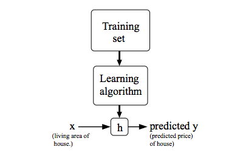
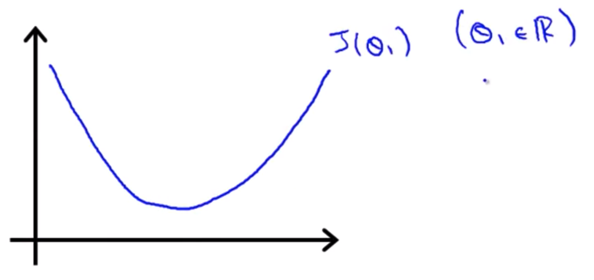

# What is Machine Learning?
Arthur Samuel described it as: "the field of study that gives computers the ability to learn without being explicitly programmed." This is an older, informal definition.

Tom Mitchell provides a more modern definition: "A computer program is said to learn from experience E with respect to some class of tasks T and performance measure P, if its performance at tasks in T, as measured by P, improves with experience E."

Example: playing checkers.

E = the experience of playing many games of checkers

T = the task of playing checkers.

P = the probability that the program will win the next game.

In general, any machine learning problem can be assigned to one of two broad classifications: Supervised learning and Unsupervised learning.

# What is Supervised learning?

In supervised learning, we are given a data set and already know what our correct output should look like, having the idea that there is a relationship between the input and the output.

Supervised learning problems are categorized into "regression" and "classification" problems. In a regression problem, we are trying to predict results within a continuous output, meaning that we are trying to map input variables to some continuous function. In a classification problem, we are instead trying to predict results in a discrete output. In other words, we are trying to map input variables into discrete categories.

Example 1:

Given data about the size of houses on the real estate market, try to predict their price. Price as a function of size is a continuous output, so this is a regression problem.
We could turn this example into a classification problem by instead making our output about whether the house "sells for more or less than the asking price." Here we are classifying the houses based on price into two discrete categories.

Example 2:

(a) Regression - Given a picture of a person, we have to predict their age on the basis of the given picture

(b) Classification - Given a patient with a tumor, we have to predict whether the tumor is malignant or benign.

# Unsupervised Learning

Unsupervised learning allows us to approach problems with little or no idea what our results should look like. We can derive structure from data where we don't necessarily know the effect of the variables.

We can derive this structure by clustering the data based on relationships among the variables in the data.

With unsupervised learning there is no feedback based on the prediction results.

Example:

Clustering: Take a collection of 1,000,000 different genes, and find a way to automatically group these genes into groups that are somehow similar or related by different variables, such as lifespan, location, roles, and so on.

Non-clustering: The "Cocktail Party Algorithm", allows you to find structure in a chaotic environment. (i.e. identifying individual voices and music from a mesh of sounds at a cocktail party).

# Model Representation

To establish notation for future use, we’ll use  to denote the “input” variables (living area in this example), also called input features, and  to denote the “output” or target variable that we are trying to predict (price).

A pair  is called a training example, and the dataset that we’ll be using to learn—a list of m training examples —is called a training set.

Note that the superscript “” in the notation is simply an index into the training set, and has nothing to do with exponentiation. We will also use X to denote the space of input values, and Y to denote the space of output values. In this example, .

To describe the supervised learning problem slightly more formally, our goal is, given a training set, to learn a function  so that  is a “good” predictor for the corresponding value of . For historical reasons, this function  is called a hypothesis. Seen pictorially, the process is therefore like this:

When the target variable that we’re trying to predict is continuous, such as in our housing example, we call the learning problem a regression problem. When y can take on only a small number of discrete values (such as if, given the living area, we wanted to predict if a dwelling is a house or an apartment, say), we call it a classification problem.

# Cost Function

We can measure the accuracy of our hypothesis function by using a cost function. This takes an average difference (actually a fancier version of an average) of all the results of the hypothesis with inputs from x's and the actual output y's.

To break it apart, it is  where  is the mean of the squares of , or the difference between the predicted value and the actual value.

This function is otherwise called the "Squared error function", or "Mean squared error". The mean is halved  as a convenience for the computation of the gradient descent, as the derivative term of the square function will cancel out the .

The idea is to choose the  so that  is close to  for our training examples 

# Cost Function - Intuition I

If we try to think of it in visual terms, our training data set is scattered on the x-y plane. We are trying to make a straight line (defined by  which passes through these scattered data points.

Our objective is to get the best possible line. The best possible line will be such so that the average squared vertical distances of the scattered points from the line will be the least. Ideally, the line should pass through all the points of our training data set. In such a case, the value of  will be 0. The following example shows the ideal situation where we have a cost function of 0.

When  , we get a slope of 1 which goes through every single data point in our model. Conversely, when , we see the vertical distance from our fit to the data points increase.

This increases our cost function to 0.58. Plotting several other points yields to the following graph:

Thus as a goal, we should try to minimize the cost function. In this case,  is our global minimum.

# Cost Function - Intuition II

A contour plot is a graph that contains many contour lines. A contour line of a two variable function has a constant value at all points of the same line. An example of such a graph is the one to the right below.

Taking any color and going along the 'circle', one would expect to get the same value of the cost function. For example, the three green points found on the green line above have the same value for  and as a result, they are found along the same line. The circled  displays the value of the cost function for the graph on the left when  and . Taking another  and plotting its contour plot, one gets the following graphs:

When  and , the value of  in the contour plot gets closer to the center thus reducing the cost function error. Now giving our hypothesis function a slightly positive slope results in a better fit of the data.

The graph above minimizes the cost function as much as possible and consequently, the result of  and  tend to be around 0.12 and 250 respectively. Plotting those values on our graph to the right seems to put our point in the center of the inner most 'circle'.

# Gradient Descent

So we have our hypothesis function and we have a way of measuring how well it fits into the data. Now we need to estimate the parameters in the hypothesis function. That's where gradient descent comes in.

Imagine that we graph our hypothesis function based on its fields  and  (actually we are graphing the cost function as a function of the parameter estimates). We are not graphing x and y itself, but the parameter range of our hypothesis function and the cost resulting from selecting a particular set of parameters.

We put  on the x axis and  on the y axis, with the cost function on the vertical z axis. The points on our graph will be the result of the cost function using our hypothesis with those specific theta parameters. The graph below depicts such a setup.

We will know that we have succeeded when our cost function is at the very bottom of the pits in our graph, i.e. when its value is the minimum. The red arrows show the minimum points in the graph.

The way we do this is by taking the derivative (the tangential line to a function) of our cost function. The slope of the tangent is the derivative at that point and it will give us a direction to move towards. We make steps down the cost function in the direction with the steepest descent. The size of each step is determined by the parameter , which is called the learning rate.

For example, the distance between each 'star' in the graph above represents a step determined by our parameter ,. A smaller  would result in a smaller step and a larger , results in a larger step. The direction in which the step is taken is determined by the partial derivative of . Depending on where one starts on the graph, one could end up at different points. The image above shows us two different starting points that end up in two different places.

The gradient descent algorithm is:

where:

 represents the feature index number,  is the assigment ("update") math symbol and  is the learning rate.

At each iteration j, one should simultaneously update the parameters . Updating a specific parameter prior to calculating another one on the  iteration would yield to a wrong implementation:

# Gradient Descent Intuition

We are going to explore the scenario where we used one parameter  and plotted its cost function to implement a gradient descent.

- The derivate term ()

We start at a random point on the function , e.g  in the x axis. We compute the derivative \frac{d}{d\theta_1}, that is the tangent line to the point . We discover that it is positive, now the function know that the point is a in positive slope (given that the slope is the derivative of ). So, the update is going to be  minus  times some positive number:

With the update, the gradient descent drives  to the left, closer to the minimum.

It can happen the opposite, the slope of the tangent line is negative given that the derivative of  is negative. With the formula we see that negative  times the negative derivative makes the  bigger, driving the updated  to the right.

In any case, regardless of the slope's sign for  eventually converges to its minimum value.

- Learning rate ()

We should adjust our parameter  to ensure that the gradient descent algorithm converges in a reasonable time. Failure to converge or too much time to obtain the minimum value imply that our step size is wrong.

Gradient descent can converge to a local minimum, even with the learning rate  fixed. As we approach a local minimum, gradient descent will automatically take smaller steps. So, no need to decrease  over time.

Note that if you are already at the local optimum it leaves  unchanged cause its updates as .

# Gradient Descent For Linear Regression

When specifically applied to the case of linear regression (the "OLS" cost function), a new form of the gradient descent equation can be derived. We substitute the gradient descent algorithm:

With our actual hypothesis function and our actual cost function:

For the partial derivate, we derivate with respect of  and :

* For 

* For 

Resulting in:

repeat until convergence {

}

The point of all this is that if we start with a guess for our hypothesis and then repeatedly apply these gradient descent equations, our hypothesis will become more and more accurate.

So, this is simply gradient descent on the original cost function J. This method looks at every example in the entire training set on every step, and is called batch gradient descent.

Note that, while gradient descent can be susceptible to local minimum in general, the optimization problem we have posed here for linear regression has only one global, and no other local,thus gradient descent always converges (assuming the learning rate α is not too large) to the global minimum.

# Multiple Features

The multivariable form of the hypothesis function accommodating these multiple features is as follows:

Using the definition of matrix multiplication, our multivariable hypothesis function can be concisely represented as:

# Gradient Descent for Multiple Variables

The gradient descent equation itself is generally the same form; we just have to repeat it for our 'n' features:

In other words:

# Gradient Descent in Practice I - Feature Scaling

We can speed up gradient descent by having each of our input values in roughly the same range. This is because  will descend quickly on small ranges and slowly on large ranges, and so will oscillate inefficiently down to the optimum when the variables are very uneven.

The way to prevent this is to modify the ranges of our input variables so that they are all roughly the same. Ideally: 

These aren't exact requirements; we are only trying to speed things up. The goal is to get all input variables into roughly one of these ranges, give or take a few.

Two techniques to help with this are feature scaling and mean normalization.
* Feature scaling involves dividing the input values by the range (i.e. the maximum value minus the minimum value) of the input variable, resulting in a new range of just 1.

* Mean normalization involves subtracting the average value for an input variable from the values for that input variable resulting in a new average value for the input variable of just zero. To implement both of these techniques, adjust your input values as shown in this formula:

Where  is the average of  in the training set, and 
is a measure of dispersion, either the range of values (max - min), or the standard deviation.

# Gradient Descent in Practice II - Learning Rate

* Debugging.

How to make sure that the gradient descent is working correctly?

Make a plot with number of iterations on the x-axis. Now plot the cost function,  over the number of iterations of gradient descent. If learning rate  is sufficiently small, then  will decrease on every iteration.

If  ever increases, then you probably need to decrease .

* Automatic convergence test. Declare convergence if  decreases by less than  in one iteration, where  is some small value such as . However in practice it's difficult to choose this threshold value, it's usually clear when you graph it.

Try with a scale factors of alpha: 

# Features and Polynomial Regression

We can change the behavior or curve of our hypothesis function by making it a quadratic, cubic or square root function (or any other form). For example: 

One important thing to keep in mind is, if you choose your features this way then feature scaling becomes very important.

For example: if  has range , then range of  becomes , and the range of  becomes 

# Normal Equation

Gradient descent gives one way of minimizing . Let’s discuss a second way of doing so, this time performing the minimization explicitly and without resorting to an iterative algorithm.

In the "Normal Equation" method, we will minimize  by explicitly taking its derivatives, and setting them to zero. This allows us to find the optimum theta without iteration.

The normal equation formula is:  . It finds the  that minimizes the cost function .

With the normal equation method, there is no need to choose alpha, since there is no iteration or learning rate.

The main drawback is that it is slow if the sample is very large as it needs to compute the inverse of very large matrix  and it doesn't work for more complex models than linear regression.

What if the matrix  is non-invertible (singular matrices)?

If  is noninvertible, the common causes might be having :

* Redundant features, where two features are very closely related (i.e. they are linearly dependent).

* Too many features (e.g. ). In this case, delete some features or use regularization.
