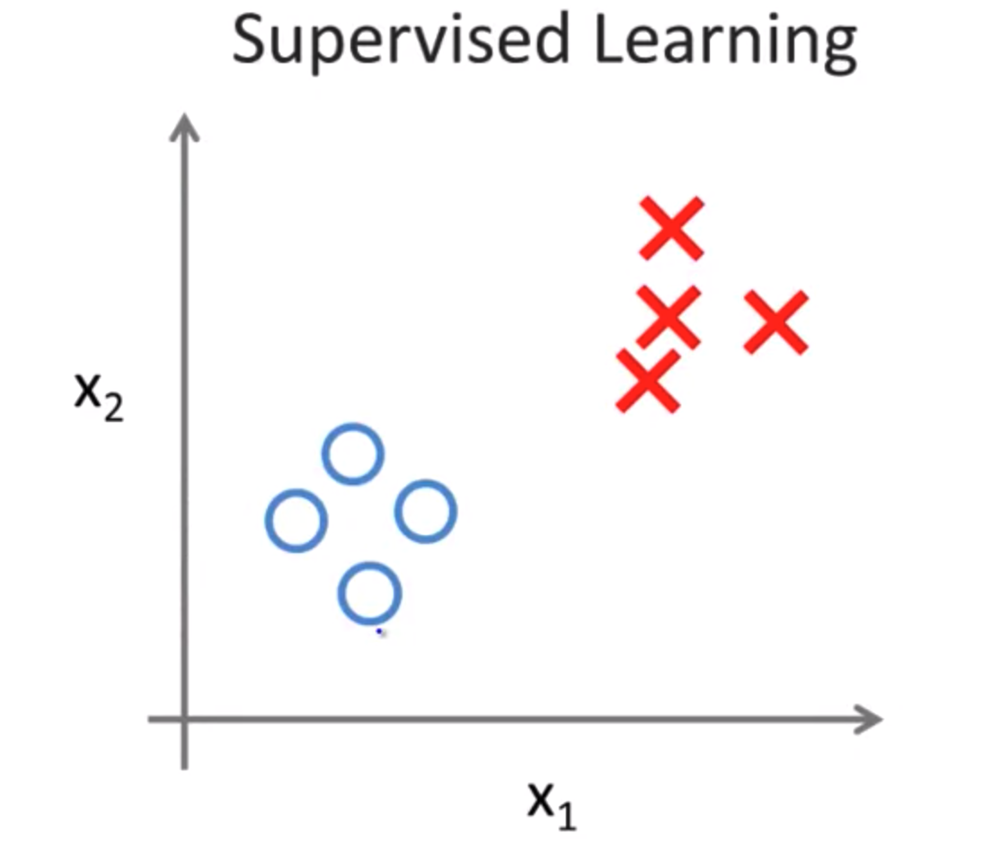
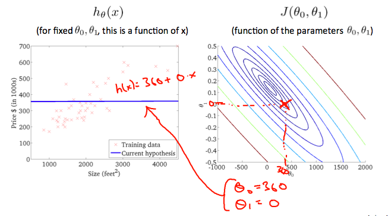

# What is Machine Learning?
Arthur Samuel described it as: "the field of study that gives computers the ability to learn without being explicitly programmed." This is an older, informal definition.

Tom Mitchell provides a more modern definition: "A computer program is said to learn from experience E with respect to some class of tasks T and performance measure P, if its performance at tasks in T, as measured by P, improves with experience E."

Example: playing checkers.

E = the experience of playing many games of checkers

T = the task of playing checkers.

P = the probability that the program will win the next game.

In general, any machine learning problem can be assigned to one of two broad classifications: Supervised learning and Unsupervised learning.

# What is Supervised learning?

In supervised learning, we are given a data set and already know what our correct output should look like, having the idea that there is a relationship between the input and the output.

Supervised learning problems are categorized into "regression" and "classification" problems. In a regression problem, we are trying to predict results within a continuous output, meaning that we are trying to map input variables to some continuous function. In a classification problem, we are instead trying to predict results in a discrete output. In other words, we are trying to map input variables into discrete categories.

Example 1:

Given data about the size of houses on the real estate market, try to predict their price. Price as a function of size is a continuous output, so this is a regression problem.
We could turn this example into a classification problem by instead making our output about whether the house "sells for more or less than the asking price." Here we are classifying the houses based on price into two discrete categories.

Example 2:

(a) Regression - Given a picture of a person, we have to predict their age on the basis of the given picture

(b) Classification - Given a patient with a tumor, we have to predict whether the tumor is malignant or benign.

# Unsupervised Learning

Unsupervised learning allows us to approach problems with little or no idea what our results should look like. We can derive structure from data where we don't necessarily know the effect of the variables.

We can derive this structure by clustering the data based on relationships among the variables in the data.

With unsupervised learning there is no feedback based on the prediction results.

Example:

Clustering: Take a collection of 1,000,000 different genes, and find a way to automatically group these genes into groups that are somehow similar or related by different variables, such as lifespan, location, roles, and so on.

Non-clustering: The "Cocktail Party Algorithm", allows you to find structure in a chaotic environment. (i.e. identifying individual voices and music from a mesh of sounds at a cocktail party).

# Model Representation

To establish notation for future use, we’ll use $x^{(i)}x(i)$ to denote the “input” variables (living area in this example), also called input features, and $y^{(i)}y(i)$ to denote the “output” or target variable that we are trying to predict (price).

A pair $(x^{(i)}, y^{(i)})$ is called a training example, and the dataset that we’ll be using to learn—a list of m training examples $(x^{(i)}, y^{(i)});i=1,...,m$—is called a training set.

Note that the superscript “$(i)$” in the notation is simply an index into the training set, and has nothing to do with exponentiation. We will also use X to denote the space of input values, and Y to denote the space of output values. In this example, $X = Y = ℝ$.

To describe the supervised learning problem slightly more formally, our goal is, given a training set, to learn a function $h : X → Y$ so that $h(x)$ is a “good” predictor for the corresponding value of $y$. For historical reasons, this function $h$ is called a hypothesis. Seen pictorially, the process is therefore like this:

When the target variable that we’re trying to predict is continuous, such as in our housing example, we call the learning problem a regression problem. When y can take on only a small number of discrete values (such as if, given the living area, we wanted to predict if a dwelling is a house or an apartment, say), we call it a classification problem.

# Cost Function

We can measure the accuracy of our hypothesis function by using a cost function. This takes an average difference (actually a fancier version of an average) of all the results of the hypothesis with inputs from x's and the actual output y's.

$J(\theta_0,\theta_1)=\frac{1}{2m}\sum\limits_{i=1}^{m}(\hat{y}_i−y_i)^2=\frac{1}{2m}\sum\limits_{i=1}^{m}(h_\theta(x_i −y_i)^2$

To break it apart, it is $\frac{1}{2}\bar{x}$ where $\bar{x}$ is the mean of the squares of $h_\theta(x_{i}) - y$, or the difference between the predicted value and the actual value.

This function is otherwise called the "Squared error function", or "Mean squared error". The mean is halved $\frac{1}{2}$ as a convenience for the computation of the gradient descent, as the derivative term of the square function will cancel out the $\frac{1}{2}$.

The idea is to choose the $\theta_0,\theta_1$ so that $h_\theta(x)$ is close to $y$ for our training examples $(x,y)$

# Cost Function - Intuition I

If we try to think of it in visual terms, our training data set is scattered on the x-y plane. We are trying to make a straight line (defined by $h_\theta(x)$ which passes through these scattered data points.

Our objective is to get the best possible line. The best possible line will be such so that the average squared vertical distances of the scattered points from the line will be the least. Ideally, the line should pass through all the points of our training data set. In such a case, the value of $J(\theta_0, \theta_1)$ will be 0. The following example shows the ideal situation where we have a cost function of 0.

When $\theta_1 = 1$ , we get a slope of 1 which goes through every single data point in our model. Conversely, when $\theta_1 = 0.5$, we see the vertical distance from our fit to the data points increase.

This increases our cost function to 0.58. Plotting several other points yields to the following graph:

Thus as a goal, we should try to minimize the cost function. In this case, $\theta_1 = 1$ is our global minimum.

# Cost Function - Intuition II

A contour plot is a graph that contains many contour lines. A contour line of a two variable function has a constant value at all points of the same line. An example of such a graph is the one to the right below.

Taking any color and going along the 'circle', one would expect to get the same value of the cost function. For example, the three green points found on the green line above have the same value for $J(\theta_0,\theta_1)$ and as a result, they are found along the same line. The circled $x$ displays the value of the cost function for the graph on the left when $\theta_0= 800_$ and $\theta_1 = -0.15$. Taking another $h(x)$ and plotting its contour plot, one gets the following graphs:

When $\theta_0 = 360$ and $\theta_1 = 0$, the value of $J(\theta_0,\theta_1)$ in the contour plot gets closer to the center thus reducing the cost function error. Now giving our hypothesis function a slightly positive slope results in a better fit of the data.

The graph above minimizes the cost function as much as possible and consequently, the result of $\theta_1$ and $\theta_0$ tend to be around 0.12 and 250 respectively. Plotting those values on our graph to the right seems to put our point in the center of the inner most 'circle'.

# Gradient Descent

So we have our hypothesis function and we have a way of measuring how well it fits into the data. Now we need to estimate the parameters in the hypothesis function. That's where gradient descent comes in.

Imagine that we graph our hypothesis function based on its fields $\theta_0$ and $\theta_1$ (actually we are graphing the cost function as a function of the parameter estimates). We are not graphing x and y itself, but the parameter range of our hypothesis function and the cost resulting from selecting a particular set of parameters.

We put $\theta_0$ on the x axis and $\theta_1$ on the y axis, with the cost function on the vertical z axis. The points on our graph will be the result of the cost function using our hypothesis with those specific theta parameters. The graph below depicts such a setup.

We will know that we have succeeded when our cost function is at the very bottom of the pits in our graph, i.e. when its value is the minimum. The red arrows show the minimum points in the graph.

The way we do this is by taking the derivative (the tangential line to a function) of our cost function. The slope of the tangent is the derivative at that point and it will give us a direction to move towards. We make steps down the cost function in the direction with the steepest descent. The size of each step is determined by the parameter $\alpha$, which is called the learning rate.

For example, the distance between each 'star' in the graph above represents a step determined by our parameter $\alpha$,. A smaller $\alpha$ would result in a smaller step and a larger $\alpha$, results in a larger step. The direction in which the step is taken is determined by the partial derivative of $J(\theta_0,\theta_1)$. Depending on where one starts on the graph, one could end up at different points. The image above shows us two different starting points that end up in two different places.

The gradient descent algorithm is:

\begin{align*}
  \theta_j := \theta_j - \alpha\frac{d}{d\theta_j}J(\theta_0,\theta_1)
\end{align*}

where

$j=0,1$ represents the feature index number, $:=$ is the assigment ("update") math symbol and $\alpha$ is the learning rate.

At each iteration j, one should simultaneously update the parameters $\theta_1, \theta_2,...,\theta_n$. Updating a specific parameter prior to calculating another one on the $j^{(th)}$ iteration would yield to a wrong implementation:

# Gradient Descent Intuition

We are going to explore the scenario where we used one parameter $\theta_1$ and plotted its cost function to implement a gradient descent.

- The derivate term ($\frac{d}{d\theta_1}$)

We start at a random point on the function $J(\tetha_1)$, e.g $\theta_1$ in the x axis. We compute the derivative \frac{d}{d\theta_1}, that is the tangent line to the point $\theta_1$. We discover that it is positive, now the function know that the point is a in positive slope (given that the slope is the derivative of $\theta_1$). So, the update is going to be $\theta_1$ minus $\alpha$ times some positive number:

With the update, the gradient descent drives $\theta_1$ to the left, closer to the minimum.

It can happen the opposite, the slope of the tangent line is negative given that the derivative of $\theta_1$ is negative. With the formula we see that negative $\alpha$ times the negative derivative makes the $\theta_1$ bigger, driving the updated $\theta_1$ to the right.

In any case, regardless of the slope's sign for $\frac{d}{d\theta_1}J(\theta_1), \theta_1$ eventually converges to its minimum value.

- learning rate ($\alpha$)

We should adjust our parameter $\alpha$ to ensure that the gradient descent algorithm converges in a reasonable time. Failure to converge or too much time to obtain the minimum value imply that our step size is wrong.

Gradient descent can converge to a local minimum, even with the learning rate $\alpha$ fixed. As we approach a local minimum, gradient descent will automatically take smaller steps. So, no need to decrease $\alpha$ over time.

Note that if you are already at the local optimum it leaves $\theta_1$ unchanged cause its updates as $\theta_j := \theta_j - \alpha\times0$.

